# Bank Data Analysis Project

The dataset used in the R project was related to "Bank Marketing Data," focusing on various attributes related to marketing campaigns and customer information

The R project you've shared revolves around statistical analysis and machine learning tasks using various libraries and frameworks:

# Statistical Libraries:

    base: Fundamental functions and operations in R.
    tidyverse: Comprehensive collection of packages for data manipulation, visualization, and analysis.
    MASS: Functions and datasets for Modern Applied Statistics with S.
    corrgram, corrplot: Libraries for creating correlation matrices and correlation plots.
    ROSE: Handling class imbalances by oversampling minority classes.
    caTools: Tools for data splitting and manipulation.
    caret: Framework for streamlining machine learning workflows, including model building and evaluation.

# Machine Learning Frameworks:

    rpart: Recursive Partitioning and Regression Trees for decision tree-based modeling.
    xgboost: Implementation of gradient boosting machines.
    randomForest: Library for building and analyzing random forests.
    glm: Generalized Linear Models for regression analysis.
    pROC: Tools for ROC analysis, used for evaluating classification models.

These libraries and frameworks cover a wide array of statistical and machine learning techniques, enabling tasks from exploratory data analysis to model building and evaluation in a structured and comprehensive manner within the R environment.

# Following were the statistical analysis visualization from the case study
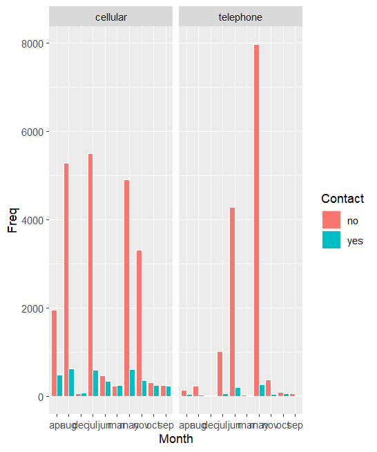 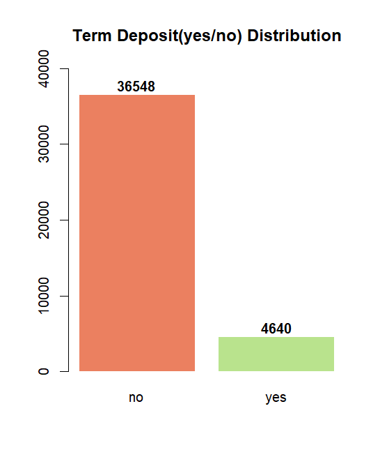 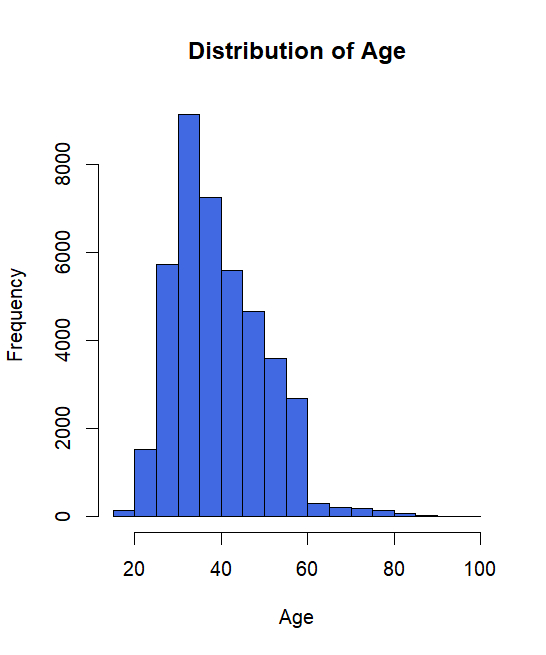 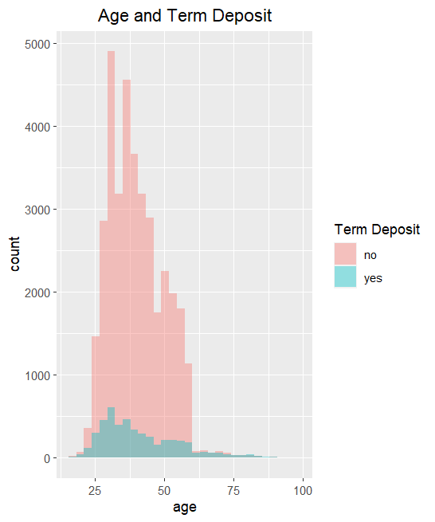 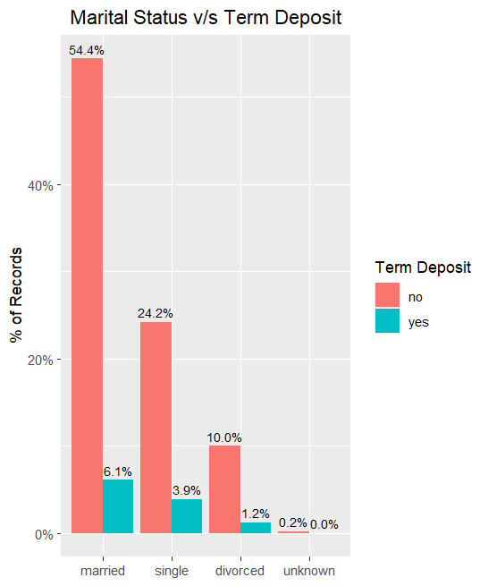 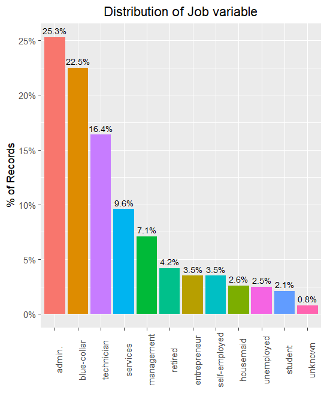  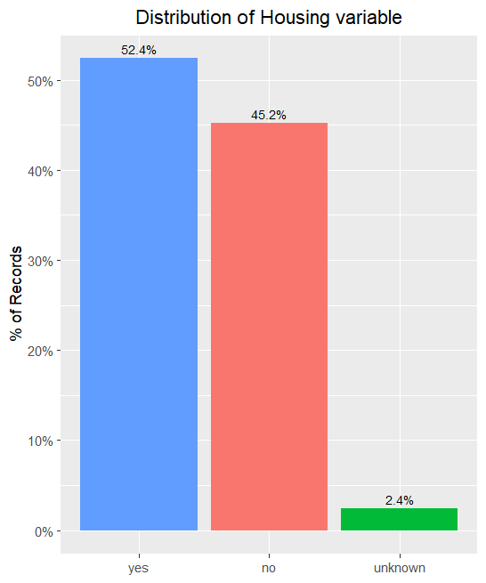 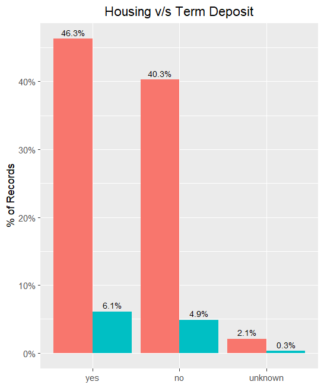 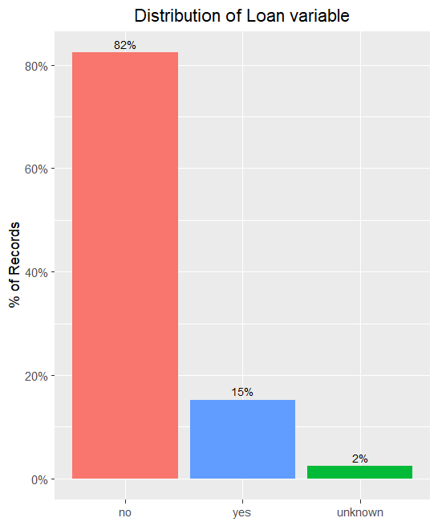 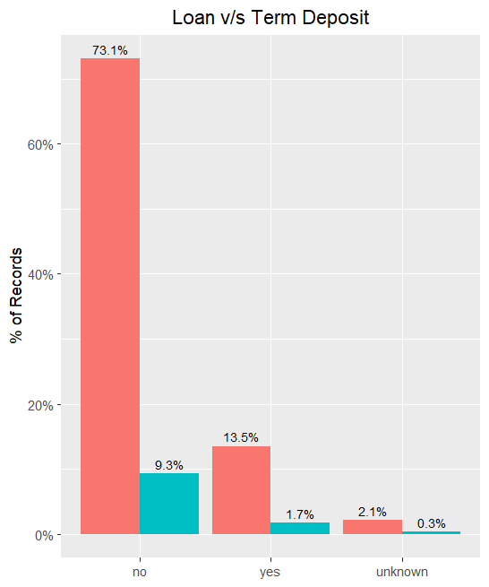 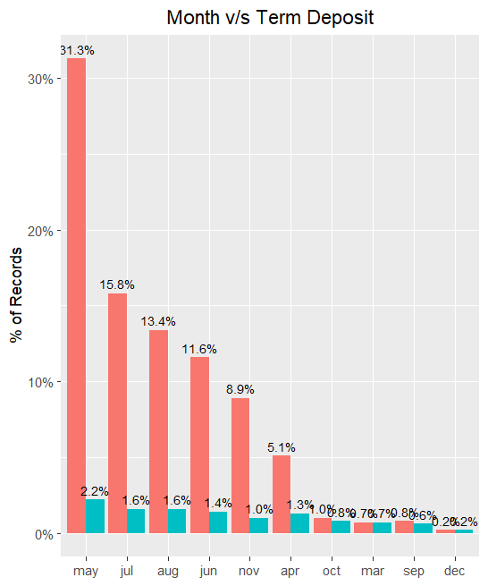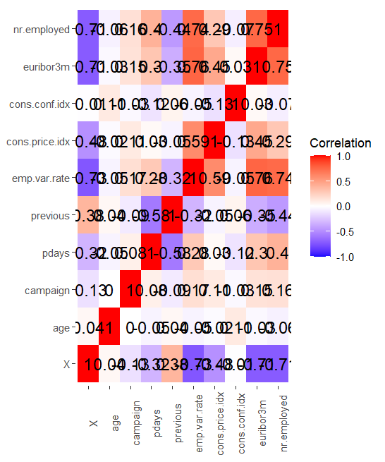

